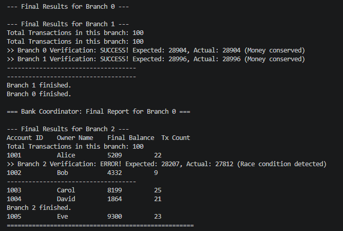
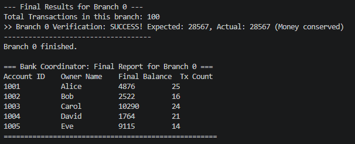

# Concurrent Bank Simulator

A Linux/POSIX C project that simulates concurrent banking operations across
multiple branches. It demonstrates how synchronization primitives protect
shared account balances when processes and threads run at the same time.

## Highlights

- Multi-process architecture using `fork()` and pipes.
- Concurrent transaction handling with POSIX threads.
- Shared account state implemented with `mmap()`.
- Per-account mutexes for safe balance updates.
- Semaphore-based throttling of active branches.
- A readers-writers synchronization mechanism for balance inquiries.
- Docker and Docker Compose support for a reproducible environment.

## Race Condition Demonstration

The project can be built with or without locking to show why synchronization
is essential when multiple workers update the same account.

### Without locks

```bash
gcc -Wall -Wextra -pthread -DNO_LOCK bank.c -o bank
./bank
```



### With mutex protection

```bash
gcc -Wall -Wextra -pthread bank.c -o bank
./bank
```



## Run with Docker

```bash
docker compose build
docker compose up
```

Transaction output is written to `logs/transactions.log`.

## Project Structure

```text
bank.c                Core concurrent banking simulation
accounts.txt          Sample account data
Makefile              Local build commands
Dockerfile            Container build definition
docker-compose.yml    Reproducible runtime configuration
race_*.png            Race-condition demonstration screenshots
```

## Notes

The account data is fictional and included only for demonstration purposes.
